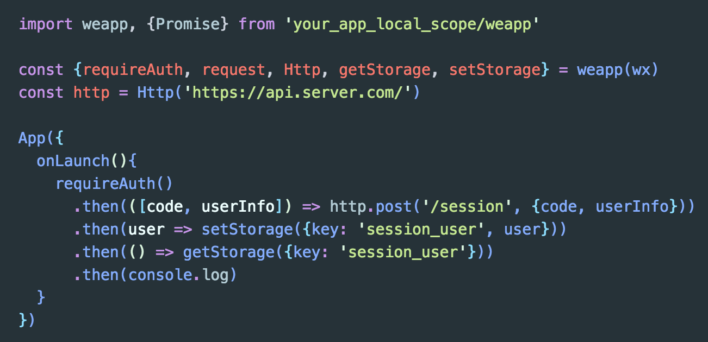

# weapp

Wechat applet official API wrapper, purpose to expose fashionable, friendly and fluent programming API.

[](https://travis-ci.org/xixilive/weapp)



## Features

- Promisified async API

- Shortcuts for `wx.request` API

- Isolated Promise polyfill (by core-js)

- Enhancements official APIs

- Optional grouped APIs:

- RESTful http client

## Install

```
# via Github
npm i xixilive/weapp --save-dev
```

```
# via npm
npm i weapp-next --save-dev
```

## Usage

`weapp` use UMD module system, you can load it in Commonjs or AMD format.

```js
import weapp, {Promise} from 'weapp'

// get wrapped wx Object
const {request, requireAuth, Http} = weapp(wx)

// use request API
request({url: 'https://test.com', method: 'GET'}).then(response => console.log)

// use shortcuts of request API, such as get, post, put, etc.
request.get('https://test.com').then(response => console.log)

// you can use an all-in-one method
weapp.requireAuth().then(([code, userInfo]) => console.log)

// use Http client
const http = Http('https://server.com/api')
http.get('/path').then(response => console.log)

// use Promise
Promise.all([...]).then()
```

## Wrapped methods

Wraps almost all of official APIs, see [Wrapped methods](./docs/METHODS.md)

## Enhancements

Creates http request shortcuts according to wechat applet declared verbs(RFC 2616). specially, the `PATCH` verb maybe useful for strict RESTful-ist, and so it has defined also.

### `weapp.request`

It resolve a response which take a statusCode in range of [200, 300), and reject a response which out of the range.

The resolved response and rejected reason/error is the response object from the native `wx.request`.

```js
import weapp from 'weapp'
const {request} = weapp(wx)

request({url, method: 'GET'})
  .then(response => {
    // response is the response object from wx.request
  })
  .catch(error => {
    // error is the response object from wx.request
  })

request.get(url:String [, init:Function])
request.post(url:String, body:String/Object, [, init:Function])
request.put(url:String, body:String/Object, [, init:Function])
request.patch(url:String, body:String/Object, [, init:Function])
request.delete(url:String [, init:Function])
request.head(url:String [, init:Function])
request.options(url:String [, init:Function])
request.trace(url:String [, init:Function])
request.connect(url:String [, init:Function])
```

Optional `init` argument is a zero-arugments function to interpolate request parameters, and it expects to return an Object value by contract. you can override any request params by the returned object except the `url` and `method`.

```js
// logic of init function
const config = {...}
return {...config, ...init(), url, method}
```

### `weapp.requireAuth`

> login and getUserInfo in parallel

```js
import weapp from 'weapp'
const {request, requireAuth} = weapp(wx)

requireAuth().then(([code, data]) => {
  return request.post('https://api.server.com/session', {code, data})  
})

// on server side:
// 1. to exchange session_key via code,
// 2. decrypt and store userInfo, and create your app scope session etc.
```

## Get grouped APIs

In order to get grouped APIs, you just to pass truthy value for the second argument.

```js
const weapp = require('weapp')(wx, true)
// equal to
const weapp = require('weapp').group(wx)
```

and you will get groups of APIs as following:

```
weapp.auth.*
weapp.device.*
weapp.file.*
weapp.geo.*
weapp.media.*
weapp.net.*
weapp.payment.*
weapp.storage.*
weapp.ui.*
```

> to visit [es6/weapp/definitions.js](./es6/weapp/definitions.js) for more details about API groups


## Use RESTful Http client

```js
import weapp from 'weapp'

const http = weapp(wx).Http('https://api.server.com/')
http.get('/status', {version: '1'}) // /status?version=1
http.post('/status', {data: {}})
```

## NOTICE

> wechat applet only load modules in `app local scope` currently, and so, you must to bundle all external dependencies into your app.

It assumes you have a app named `abc` in following structure:

```
abc/
  |-es6/
     |- app.js
  |-node_modules/
     |- weapp
     |- ...
  |-pages/
      |- start
        |- start.js
        |- start.json
        |- start.wxml
        |- start.wxss
      |- ...
  |-app.js
  |-app.json
  |-app.wxss
  |-package.json
  |-...
```

OBVIOUSLY, abc dependents on `weapp` :), but you can't to require `weapp` in abc's files directly like this:

```js
// abc/app.js
import weapp from 'weapp'

App({...})

// throw! throw! throw `module 'weapp.js' is not defined` at runtime
```

You should require `weapp` in your `local files` in this approach.

```js
// abc/es6/app.js
import weapp from 'weapp'

export {weapp}
```

and build `abc/es6` into a bundle module, then you can require your bundle version in wechat applet code. I favoured [webpack](https://webpack.github.io/) for this.

```js
// webpack.config.js

module.exports = {
  ...,
  entry: {
    'app': './es6/app.js'
  },
  output: {
    path: path.join(__dirname, 'lib'),
    filename: '[name].bundle.js',
    libraryTarget: 'umd'
  },
  ...
}
```

require bundle in applet code:

```js
import {weapp} from './lib/app.bundle'

App({....})
```

By the way, I'd write a post about [modulize wechat applet development](https://gist.github.com/xixilive/5bf1cde16f898faff2e652dbd08cf669) (written in chinese)
